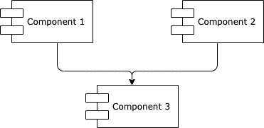
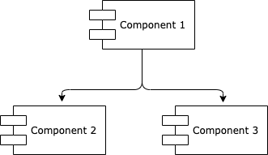
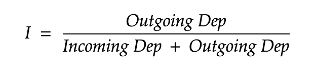
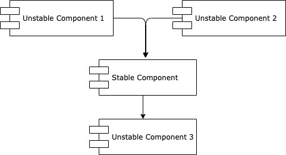
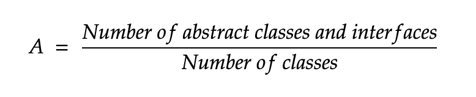
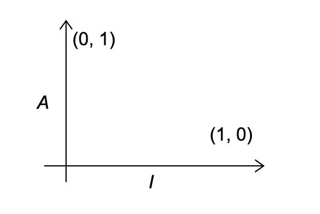
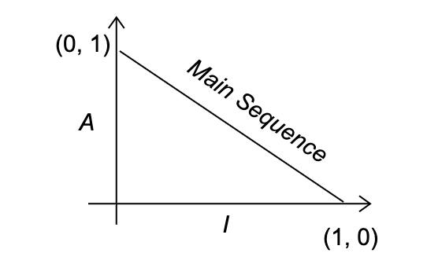
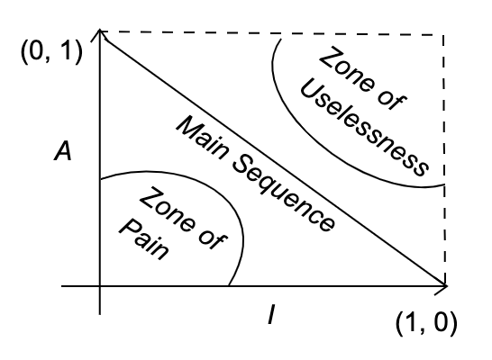
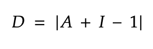

# Dependency Management Metrics Maven Plugin

---

Maven plugin that computes the Dependency Management Metrics for your multi-module Java projects.


----

### Dependency Management Metrics

The Dependency Management Metrics are defined by [Robert C.Martin](https://en.wikipedia.org/wiki/Robert_C._Martin) in
his [Clean Architecture](https://www.amazon.com/Clean-Architecture-Craftsmans-Software-Structure/dp/0134494164) book.
<p>
The metrics are consisted from two principles:
<ul>
<li>Stable Dependencies Principle</li>
<li>Stable Abstractions Principle</li>
</ul>
<p>
If you are already familiar with the theory part, feel free to skip to <b>Getting Started</b> part.

In the text below, the granularity of the term <b>component</b> is the same as a <b>module</b> in the Java ecosystem.

### Stable Dependencies Principle

----
<b><i>Any component that we expect to be volatile, should not be depended on by a component that's difficult to change.
Otherwise, the volatile component will also be difficult to change.</i></b>
<p>
A component that is designed to be very easy to change can be made very difficult by simply hanging a dependency to it
from another component that's very difficult to change.
<p>

#### Stable/Unstable Components

What actually makes a component difficult to change(a.k.a Stable Component)? Many factors may make a software component
difficult to change, i.e. its size, complexity, clarity, number of components that depend on it... For this situation
only the last case is important. A component with lots of incoming dependencies is very hard to changes. Therefore these
components are called <i>Stable Components</i>:



On the contrary, the following image shows the <i>Component 1</i> which is a very <i>Unstable Component</i>, because <i>
Component 1</i> is depended on two different components and yet no other components are depended on it:



#### Stability Metrics

We can define the <i>Stability Metrics</i> by defining the <i>Instability</i> of a component:


Now that we defined the metrics, we can define the actual principle of the <i>Stable Dependencies</i>:
<p>
<i>A component should always be dependent of a more stable component</i>
<p>

The first image shows an example where the principle holds.
<p>
The following image is an example of a clear violation of the principle:



where we can see that the <i>Stable Component</i> is dependent of an unstable <i>Unstable Component 3</i>.

### Stable Abstractions Principle

----

#### Abstract Components

<i>Abstract component</i> is a component that holds only <i>interfaces</i> or <i>abstract</i> classes. These abstract
components are very stable and ideal for less stable components to depend on.

#### Abstraction Metrics

We can define the level of <i>Abstraction</i> of a single component as follows:


Now we can define the <i>Stable Abstractions Principle</i> which states:
<p>
<i>A component should always be dependent of a more abstract component</i>
<p>

### Main Sequence

----

Now that we have defined the two principles, we can define the relationship between the <i>Stability (I)</i>
and <i>Abstractness (A)</i>:
    


If we draw a line between the (0, 1) and (1, 0) points, we get a line that's called the <i>Main Sequence</i> line:


This line is representing where all components should be.
<p>
Now we can define the place on that plot where components should not be, i.e. 
<i>Zones of Exclusions</i>:



#### Zone of Pain

Highly stable and concrete components. Not desirable because they are rigid. It cannot be extended because it's not
abstract and it's very difficult to change because of its stability.

#### Zone of Uselessness

Highly abstract components without any dependents, i.e. useless components.

A component that sits on the <i>Main Sequence</i> is neither too abstract nor is too unstable.

### Distance from <i>Main Sequence</i>

How far away is a component from the <i>Main Sequence</i>:
    


Any component that has a D metric value that's not near zero can be reexamined and restructured.

Statistical analysis of a design is also possible by calculating the mean and variance of all the D metrics for the
components within a design. A conforming design should have mean and variance values that are close to zero.

## Getting Started

This plugin calculates and outputs the metrics stated and explained above for each component within a design:

* Stability metric
* Abstraction metric
* Distance from <i>Main Sequence</i>

The plugin also outputs the components present in the <i>Zone of Pain</i> and the <i>Zone of Uselessness</i> (if there
are any) in the <i>Zones of Exclusions</i> section.

And finally the plugin can potentially break the build if any of the following principles are broken:

* Stable Dependencies Principle
* Stable Abstractions Principle

Add this to your parent pom.xml file:

```xml

<plugin>
    <groupId>com.github.ignatij</groupId>
    <artifactId>dependency-management-metrics-maven-plugin</artifactId>
    <version>1.0.17</version>
    <inherited>false</inherited>
</plugin>
```

If you want to potentially fail the build if any of the principles are violated add the <b>configuration tag the
following</b>:

```xml
<plugin>
    <groupId>com.github.ignatij</groupId>
    <artifactId>dependency-management-metrics-maven-plugin</artifactId>
    <version>1.0.17</version>
    <configuration>
        <failOnViolation>true</failOnViolation>
    </configuration>
    <inherited>false</inherited>
</plugin>
```
You can also customize the output file:
``` xml
    ...
    <configuration>
        <output.file>...</output.file>
    </configuration>
    ...
```

Feel free to report any issues or open a Pull Request for further improvements.
